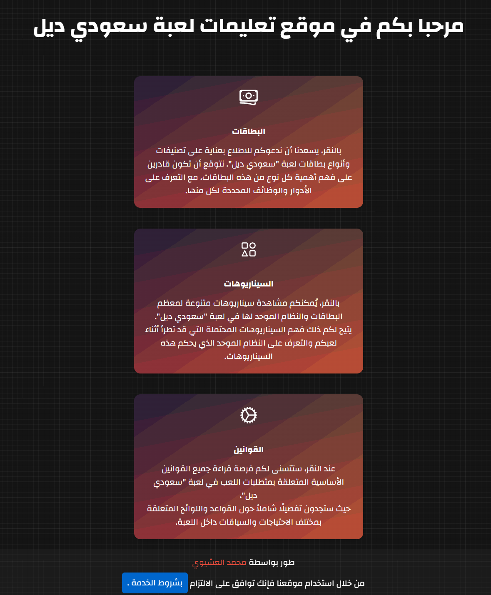
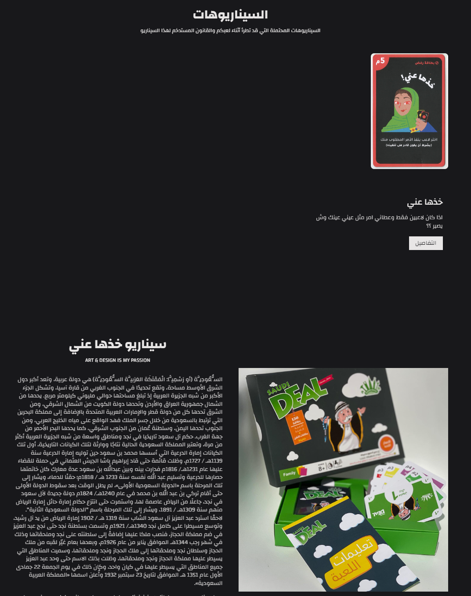
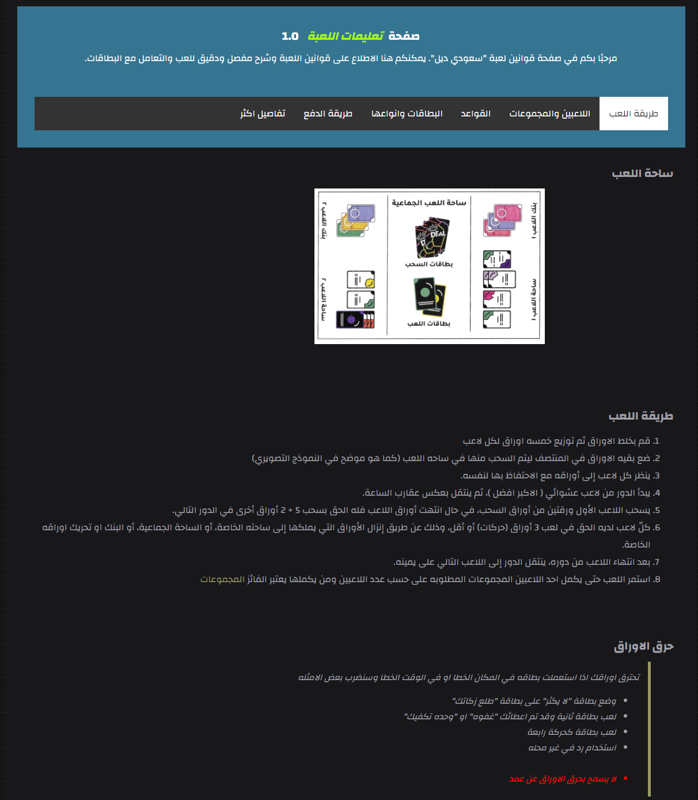
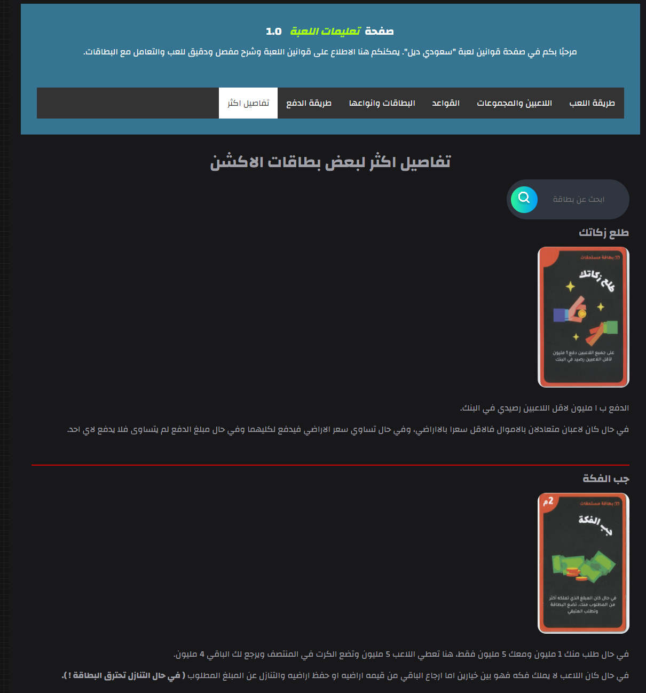

# Saudi Deal Game Reference Website

## Table of Contents

- [Project Overview](#project-overview)
- [Demo Video](#demo-video)
- [Features](#features)
- [Folder Structure](#folder-structure)
- [Usage](#usage)
- [Future Improvements](#future-improvements)
- [Acknowledgements](#acknowledgements)
- [Screenshots](#screenshots)

## Project Overview

The Saudi Deal Game Reference Website is a dedicated platform for the game "Saudi Deal," providing comprehensive information on the game's rules, cards, and various scenarios. The official catalogue lacked sufficient details, so this website serves as an in-depth reference for players and also functions as a learning project for web development.

**Note:** This project is currently incomplete and has some design and performance issues. Future development may include integrating a framework like React for improved component management.

## Demo Video

Watch the demo video showcasing the project on YouTube [here]().

## Features

- Detailed descriptions and images of all game cards
- Comprehensive rules and instructions for playing the game
- Scenarios for handling various in-game situations
- Easy-to-use navigation system for browsing different sections

## Folder Structure

```plaintext
│ index.html
│ script.js
│ style.css
│
├───screenshots
│
├───assets
│   │ playGround.png
│   │ sd1.png
│   │ sd2.jpg
│   │
│   └───SD_CARDS
│       ├───اجار
│       ├───ارض
│       ├───اكشن
│       ├───الجواكر
│       ├───رفض
│       ├───عقار
│       ├───فلوس
│       ├───مبنى
│       └───مستحقات
│
├───cards
│   │ index.html
│   │ script.js
│   │ style.css
│
├───global-styles
│   │ globalFont.css
│
├───navbar
│   │ INC_NAV.html
│
├───roles
│   │ index.html
│   │ index2.html
│   │ index3.html
│   │ index4.html
│   │ index5.html
│   │ index6.html
│   │ script.js
│   │ styles.css
│
├───Scenarios
│   │ index.html
│   │ script.js
│   │ style.css
│
└───TermsOfService
    │ TermsofService.html
```

## Usage

1. **Home Page:** The home page welcomes users and provides links to various sections such as Cards, Scenarios, and Rules.
2. **Cards Section:** Displays all the different types of cards used in the game with their images and descriptions.
3. **Scenarios Section:** Lists possible in-game scenarios and the appropriate rules to handle them.
4. **Rules Section:** Provides a detailed explanation of the game rules and instructions.
5. **Terms of Service:** Outlines the terms and conditions for using the website.

## Future Improvements

- **Framework Integration:** Integrate a framework like React for better component management and performance.
- **Design Overhaul:** Enhance the UI/UX design for a more modern and user-friendly interface.
- **Performance Optimization:** Optimize the website for better performance and faster loading times.
- **Content Expansion:** Add more detailed explanations, examples, and possibly user-generated content.

## Acknowledgements

- **Source Code:** All the source code has been developed by Mohammed Aleshawi.
- **Images:** The images of the cards belong to the Saudi Deal company.
- **Disclaimer:** The developer is not responsible for any misuse of this website.

## Screenshots

Here are some screenshots of the website:

#### Welcome Page :



#### Cards Page :


#### Scenarios Page :



#### Roles Page :



#### Roles Page :

## 

Thank you for visiting the Saudi Deal Game Reference Website. For any suggestions or feedback, please contact Me.
